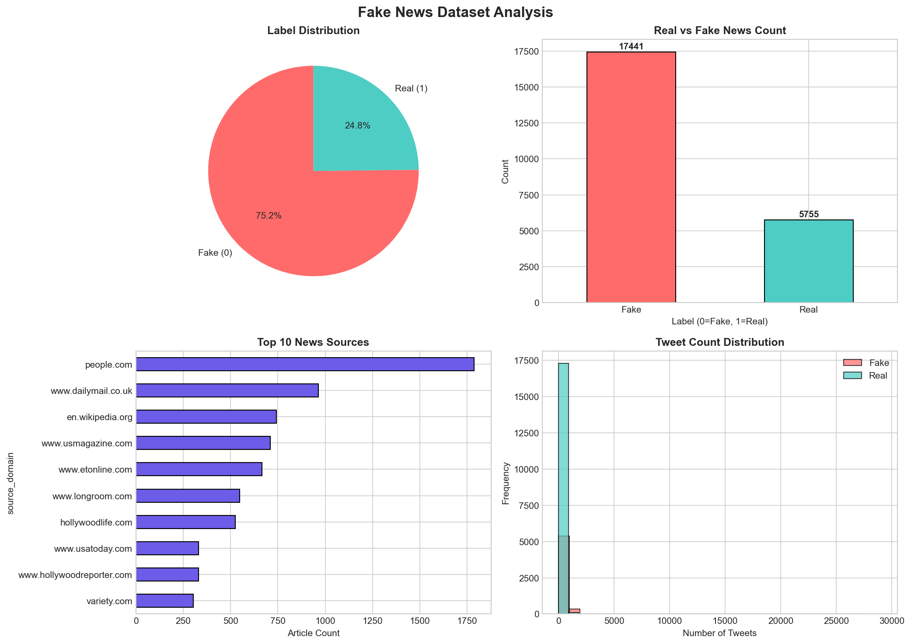

# Fake News Detection Data Cleaning & Analysis

A Python project for cleaning, preprocessing, and analyzing the FakeNewsNet dataset for fake news detection research.

## Dataset Summary

| Metric | Value |
|--------|-------|
| **Total Records** | 23,196 |
| **Real News** | 17,441 (75.2%) |
| **Fake News** | 5,755 (24.8%) |
| **Features** | 5 |
| **After Cleaning** | 22,730 records |

## Features

- **Data Cleaning**: Removes duplicates and missing values
- **Text Preprocessing**: Cleans whitespace from text fields
- **Data Validation**: Ensures numeric and binary fields are properly typed
- **Visualization**: Generates plots for data analysis

## Generated Outputs

### Main Analysis Dashboard

### Source Distribution

## Top News Sources

| Rank | Source | Articles |
|------|--------|----------|
| 1 | people.com | 1,786 |
| 2 | dailymail.co.uk | 964 |
| 3 | wikipedia.org | 741 |
| 4 | usmagazine.com | 709 |
| 5 | etonline.com | 666 |

## Dataset Columns

| Column | Type | Description |
|--------|------|-------------|
| `title` | string | News article title |
| `news_url` | string | URL to the article |
| `source_domain` | string | Domain of the news source |
| `tweet_num` | integer | Number of tweets about the article |
| `real` | binary | 1 = Real news, 0 = Fake news |

MIT License

## Contributing

Pull requests are welcome. For major changes, please open an issue first to discuss what you would like to change.
